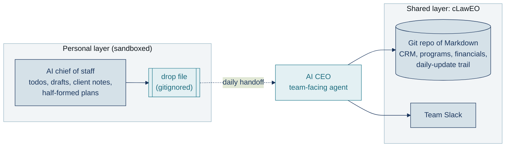
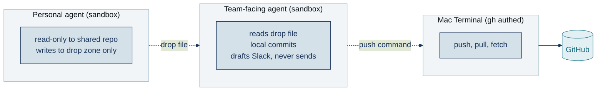

# AI chief of staff meets AI CEO: a workable sync framework

Atticus has gone fully agentic. A team of two is operating at the level of two full-stack teams with a dozen employees: we made the dream work.

The engine is a simple end-of-day sync protocol between two AI agents, and this post shares it.

There was considerable friction going into this: I run two AI systems in my work, and they do not always communicate. One is my personal chief of staff agent. It tracks my todos, drafts my emails, holds the half-formed plans and the client-specific notes that should never cross into a shared view. The other is cLawEO, [The Atticus Project](https://www.atticusprojectai.org)'s CEO-level agentic operating system, named for the c[law]EO play on CLO/CEO/law. It lives in a Git repo of Markdown the whole team reasons over: contacts, program state, financials, a rolling daily-update audit trail, a team Slack channel built on top. cLawEO is our implementation of the Agentic Knowledge Operating System framework that Jônadas Techio and Fábio Ramos described in their April 2026 Axur practitioner's report.

For about a dozen daily runs, I felt the drift between the two systems. My personal layer always knew more than the shared repo. The Axur paper calls this pattern "silent drift" and names it the default failure mode for two-system setups. It recommends a daily agent-assisted audit. This is the protocol I run.

## What I was trying to solve

At end of day I need to answer four questions:

1. What changed today that the shared repo should know about?
2. For each change, which file updates and how?
3. What is today's entry in the rolling audit trail?
4. What is the one-paragraph Slack summary?

I tried answering all four at once and kept failing. Each output needs the previous one as input.

<svg viewBox="0 0 800 140" xmlns="http://www.w3.org/2000/svg">
  <defs>
    <marker id="arrQ" viewBox="0 0 10 10" refX="8" refY="5" markerWidth="8" markerHeight="8" orient="auto">
      <path d="M 0 0 L 10 5 L 0 10 z" fill="#1B365D"/>
    </marker>
  </defs>
  <g font-family="Calibri, Arial, sans-serif">
    <rect x="10" y="25" width="175" height="90" rx="6" fill="#D5E1E8" stroke="#1B365D" stroke-width="2"/>
    <text x="97.5" y="50" text-anchor="middle" font-size="11" font-weight="bold" fill="#1B365D" letter-spacing="0.06em">QUESTION 1</text>
    <text x="97.5" y="78" text-anchor="middle" font-size="13" fill="#1B365D">What changed</text>
    <text x="97.5" y="96" text-anchor="middle" font-size="13" fill="#1B365D">today?</text>
    <line x1="188" y1="70" x2="210" y2="70" stroke="#1B365D" stroke-width="2" marker-end="url(#arrQ)"/>
    <rect x="212" y="25" width="175" height="90" rx="6" fill="#D5E1E8" stroke="#1B365D" stroke-width="2"/>
    <text x="299.5" y="50" text-anchor="middle" font-size="11" font-weight="bold" fill="#1B365D" letter-spacing="0.06em">QUESTION 2</text>
    <text x="299.5" y="78" text-anchor="middle" font-size="13" fill="#1B365D">Which file updates,</text>
    <text x="299.5" y="96" text-anchor="middle" font-size="13" fill="#1B365D">and how?</text>
    <line x1="390" y1="70" x2="412" y2="70" stroke="#1B365D" stroke-width="2" marker-end="url(#arrQ)"/>
    <rect x="414" y="25" width="175" height="90" rx="6" fill="#D5E1E8" stroke="#1B365D" stroke-width="2"/>
    <text x="501.5" y="50" text-anchor="middle" font-size="11" font-weight="bold" fill="#1B365D" letter-spacing="0.06em">QUESTION 3</text>
    <text x="501.5" y="78" text-anchor="middle" font-size="13" fill="#1B365D">Today's audit</text>
    <text x="501.5" y="96" text-anchor="middle" font-size="13" fill="#1B365D">trail entry?</text>
    <line x1="592" y1="70" x2="614" y2="70" stroke="#1B365D" stroke-width="2" marker-end="url(#arrQ)"/>
    <rect x="616" y="25" width="175" height="90" rx="6" fill="#E3F0F3" stroke="#2A7F91" stroke-width="2"/>
    <text x="703.5" y="50" text-anchor="middle" font-size="11" font-weight="bold" fill="#1A6B7D" letter-spacing="0.06em">QUESTION 4</text>
    <text x="703.5" y="78" text-anchor="middle" font-size="13" fill="#1A6B7D">One-paragraph</text>
    <text x="703.5" y="96" text-anchor="middle" font-size="13" fill="#1A6B7D">Slack summary?</text>
    <text x="400" y="135" text-anchor="middle" font-size="11" font-style="italic" fill="#6B6B6B">each question's answer is input to the next</text>
  </g>
</svg>

## The pattern

Four passes. One session of my personal agent. One drop file with four sections. Each pass writes its section and feeds the next.

**Pass 1: Scan.** Inventory today's personal-layer activity. Flag anything that should update the shared repo: new contacts, pipeline movement, program state, decisions, financial actuals, waiting-on items. Inventory only. No drafting.

**Pass 2: Commit manifest.** For each flagged change, draft the precise repo edit: file path, description, proposed content, push style (direct vs PR). My personal agent drafts; a separate team-facing agent executes later.

**Pass 3: Daily update file.** Write today's rolling-audit-trail entry at the repo's expected path. Project-sectioned, info-dense, narrative form of Pass 2 with named specifics throughout.

**Pass 4: Team broadcast.** Tight Slack post. TL;DR of Pass 3. Ownership tags in trailing parens. Draft only, never auto-send; the team-facing agent stages it and I send from the Slack UI.

All four write into one drop file at `team/personal_kat/_pending_commits/YYYY-MM-DD.md`, gitignored, personal-layer only. The drop file is the handoff contract.

## Why ordering is the point

Each output depends on the previous one. Drafting commits mid-inventory produces commits that miss items surfacing later. Writing the daily update before the manifest produces gaps, because the manifest is the checklist the narrative writes against. Writing the broadcast before the daily update produces a confident summary of an incomplete picture. The stable order is what buys the reliability.

<svg viewBox="0 0 800 170" xmlns="http://www.w3.org/2000/svg">
  <defs>
    <marker id="arrP" viewBox="0 0 10 10" refX="8" refY="5" markerWidth="8" markerHeight="8" orient="auto">
      <path d="M 0 0 L 10 5 L 0 10 z" fill="#1B365D"/>
    </marker>
  </defs>
  <g font-family="Calibri, Arial, sans-serif">
    <text x="400" y="25" text-anchor="middle" font-size="12" font-style="italic" fill="#6B6B6B">break the order, lose the dependency</text>
    <rect x="10" y="50" width="160" height="70" rx="6" fill="#D5E1E8" stroke="#1B365D" stroke-width="2"/>
    <text x="90" y="75" text-anchor="middle" font-size="12" font-weight="bold" fill="#1B365D">Pass 1: Scan</text>
    <text x="90" y="95" text-anchor="middle" font-size="11" fill="#4A4A4A">inventory changes</text>
    <path d="M 173 85 L 213 85" stroke="#1B365D" stroke-width="2" marker-end="url(#arrP)"/>
    <text x="193" y="72" text-anchor="middle" font-size="10" font-style="italic" fill="#1A6B7D">inventory list</text>
    <rect x="216" y="50" width="160" height="70" rx="6" fill="#D5E1E8" stroke="#1B365D" stroke-width="2"/>
    <text x="296" y="75" text-anchor="middle" font-size="12" font-weight="bold" fill="#1B365D">Pass 2: Manifest</text>
    <text x="296" y="95" text-anchor="middle" font-size="11" fill="#4A4A4A">draft repo edits</text>
    <path d="M 379 85 L 419 85" stroke="#1B365D" stroke-width="2" marker-end="url(#arrP)"/>
    <text x="399" y="72" text-anchor="middle" font-size="10" font-style="italic" fill="#1A6B7D">commit list</text>
    <rect x="422" y="50" width="160" height="70" rx="6" fill="#D5E1E8" stroke="#1B365D" stroke-width="2"/>
    <text x="502" y="75" text-anchor="middle" font-size="12" font-weight="bold" fill="#1B365D">Pass 3: Daily Update</text>
    <text x="502" y="95" text-anchor="middle" font-size="11" fill="#4A4A4A">narrative entry</text>
    <path d="M 585 85 L 625 85" stroke="#1B365D" stroke-width="2" marker-end="url(#arrP)"/>
    <text x="605" y="72" text-anchor="middle" font-size="10" font-style="italic" fill="#1A6B7D">full narrative</text>
    <rect x="628" y="50" width="160" height="70" rx="6" fill="#E3F0F3" stroke="#2A7F91" stroke-width="2"/>
    <text x="708" y="75" text-anchor="middle" font-size="12" font-weight="bold" fill="#1A6B7D">Pass 4: Broadcast</text>
    <text x="708" y="95" text-anchor="middle" font-size="11" fill="#4A4A4A">TL;DR Slack post</text>
    <text x="400" y="155" text-anchor="middle" font-size="11" fill="#6B6B6B">each pass reduces the previous one's output into a tighter form</text>
  </g>
</svg>

## What crosses, and what stays

The hardest design question in a two-system setup is the wall.

**Crosses into the shared repo and broadcast:** substantive ships, canonical-state changes (contacts, pipeline, program details, team roles), cross-team decisions, financial actuals, waiting-on items, external activity.

**Stays in the personal layer:** email and message draft **content** ("sent to X" crosses; the draft text does not), pre-send marketing drafts, client-specific workflow detail, internal role-play scaffolding, effort-level audits, personal scratchpad.

Without a written wall, drift is the default. With one, each pass has a test to apply.

<svg viewBox="0 0 800 340" xmlns="http://www.w3.org/2000/svg">
  <g font-family="Calibri, Arial, sans-serif">
    <rect x="20" y="20" width="360" height="50" fill="#E3F0F3" stroke="#2A7F91" stroke-width="2" rx="6"/>
    <text x="200" y="45" text-anchor="middle" font-size="18" font-weight="bold" font-family="Georgia, serif" fill="#1A6B7D">Crosses</text>
    <text x="200" y="62" text-anchor="middle" font-size="11" fill="#6B6B6B">into shared repo and broadcast</text>
    <rect x="420" y="20" width="360" height="50" fill="#F2F5F7" stroke="#1B365D" stroke-width="2" rx="6"/>
    <text x="600" y="45" text-anchor="middle" font-size="18" font-weight="bold" font-family="Georgia, serif" fill="#1B365D">Stays</text>
    <text x="600" y="62" text-anchor="middle" font-size="11" fill="#6B6B6B">personal layer only</text>
    <rect x="395" y="10" width="10" height="310" fill="#9CB9C7"/>
    <text x="400" y="335" text-anchor="middle" font-size="11" font-style="italic" fill="#6B6B6B">the wall</text>
    <text x="40" y="105" font-size="14" fill="#4A4A4A">✓  substantive ships</text>
    <text x="40" y="135" font-size="14" fill="#4A4A4A">✓  canonical-state changes</text>
    <text x="40" y="165" font-size="14" fill="#4A4A4A">✓  cross-team decisions</text>
    <text x="40" y="195" font-size="14" fill="#4A4A4A">✓  financial actuals</text>
    <text x="40" y="225" font-size="14" fill="#4A4A4A">✓  waiting-on items</text>
    <text x="40" y="255" font-size="14" fill="#4A4A4A">✓  external activity</text>
    <text x="440" y="105" font-size="14" fill="#4A4A4A">✗  email and Slack draft content</text>
    <text x="440" y="135" font-size="14" fill="#4A4A4A">✗  pre-send marketing drafts</text>
    <text x="440" y="165" font-size="14" fill="#4A4A4A">✗  client-specific workflow detail</text>
    <text x="440" y="195" font-size="14" fill="#4A4A4A">✗  internal role-play scaffolding</text>
    <text x="440" y="225" font-size="14" fill="#4A4A4A">✗  effort-level audits</text>
    <text x="440" y="255" font-size="14" fill="#4A4A4A">✗  personal scratchpad</text>
  </g>
</svg>

## Auth, and why the split matters

Authentication splits across three environments. The personal agent has read-only access to the shared repo and writes only into the gitignored drop zone. The team-facing agent reads the drop file, commits locally, and drafts the Slack post (never sends). Network git runs in a separate terminal with the GitHub CLI authenticated as me. The sandbox never holds credentials it should not, and the team chat never receives personal-layer content without a human in the loop.

## Try it

The repo at [katf167/four-pass-eod-pattern](https://github.com/katf167/four-pass-eod-pattern) has the full template set: per-pass prompt skeletons, decision rules, anti-patterns, and a fictional worked example. Opinionated on the four passes and the drop-file contract; everything else is up to you.

The pattern generalizes beyond my setup. If you have a personal AI layer and a shared team knowledge base, you have the two-system problem. Four passes, in this order, has been the stable recipe.

At [Atticus](https://www.atticusprojectai.org) we teach legal teams how to build their own version of this in our [1:1 coaching service](mailto:aicoach@atticusprojectai.org) and in our [AI Habits for Legal Professionals](https://maven.com/the-atticus-project/ai-habits-for-legal-professionals/) cohort on Maven.

<svg viewBox="0 0 800 260" xmlns="http://www.w3.org/2000/svg">
  <g font-family="Calibri, Arial, sans-serif">
    <rect x="10" y="10" width="780" height="240" fill="#F2F5F7" stroke="#9CB9C7" stroke-width="1" rx="8"/>
    <text x="400" y="42" text-anchor="middle" font-size="16" font-weight="bold" font-family="Georgia, serif" fill="#1B365D">The Four-Pass EOD Pattern, at a glance</text>
    <rect x="30" y="60" width="740" height="38" fill="#D5E1E8" stroke="#1B365D" stroke-width="1" rx="4"/>
    <text x="50" y="84" font-size="13" font-weight="bold" fill="#1B365D">Pass 1: Scan</text>
    <text x="240" y="84" font-size="13" fill="#4A4A4A">Inventory today's canonical-state changes. No drafting.</text>
    <rect x="30" y="104" width="740" height="38" fill="#D5E1E8" stroke="#1B365D" stroke-width="1" rx="4"/>
    <text x="50" y="128" font-size="13" font-weight="bold" fill="#1B365D">Pass 2: Manifest</text>
    <text x="240" y="128" font-size="13" fill="#4A4A4A">Draft precise repo edits: file, change, push style.</text>
    <rect x="30" y="148" width="740" height="38" fill="#D5E1E8" stroke="#1B365D" stroke-width="1" rx="4"/>
    <text x="50" y="172" font-size="13" font-weight="bold" fill="#1B365D">Pass 3: Daily Update</text>
    <text x="240" y="172" font-size="13" fill="#4A4A4A">Write the rolling audit trail entry. Narrative form.</text>
    <rect x="30" y="192" width="740" height="38" fill="#E3F0F3" stroke="#2A7F91" stroke-width="1" rx="4"/>
    <text x="50" y="216" font-size="13" font-weight="bold" fill="#1A6B7D">Pass 4: Broadcast</text>
    <text x="240" y="216" font-size="13" fill="#4A4A4A">Tight Slack TL;DR. Draft only, human sends.</text>
    <text x="400" y="248" text-anchor="middle" font-size="11" font-style="italic" fill="#6B6B6B">all four write into one drop file, handed off to the team-facing agent</text>
  </g>
</svg>
